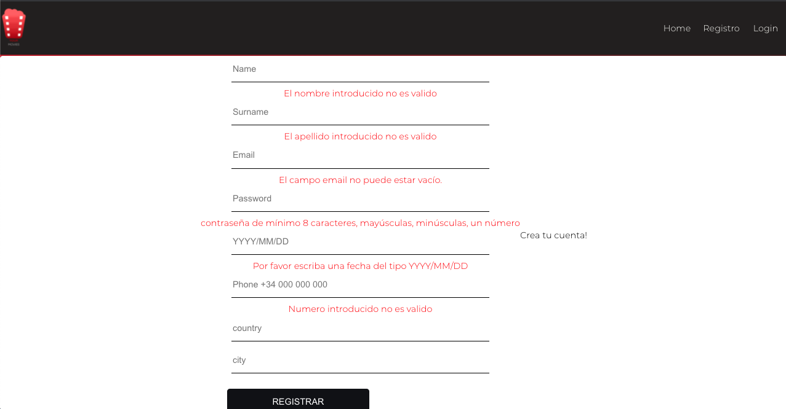

<a name="top"></a>

<h1>Movie rental App - Frontend</h1>


<b>Your Movies</b>


</details>


🧐 [About](#id1)   

💻 [Technologys](#id2)

:clipboard: [Instructions](#id3)

⚙️ [Phase I backend development](#id4)
⚙️ [Phase II Frontend development](#id5)


---

<a name="id1"></a>
## **About**

This is the frontend for a movie rental aplication.

This project is part of the Full Stack Developer Bootcamp taught by [GeeksHubs Academy](https://bootcamp.geekshubsacademy.com/).

---
**Working time on the project**
**Start Date:** 21/ jun /2021
**Deadline:** 05/ july / 2021

**Made by:**

* [Juan Felipe Porras Gallego](https://github.com/juanfegallego)

---

<a name="id2"></a>

## **Technologies**

These are the technologies with which we have worked in this project:
       


<a name="id3"></a>
***
## **Instructions**
<details>

<summary>Click to expand</summary>

<br>

- <b>To install all dependencies</b>
```
    $ npm i
```


</details>

<a name="id4"></a>
## [Phase I Backend development](https://github.com/juanfegallego/Backend_Movies)
<a name="id5"></a>
## Phase II Frontedckend development
<!-- <details> -->


The project consists of the development of a movie rental aplication system from the backend to the frontend.

For the project that used a database with MySQL workbench, in addition to the API [The Movie DB](https://developers.themoviedb.org/3).

The frontend has these sections:

<b>Home</b>
<details>
<summary>Click to expand</summary>

</details>

</details>

<b>Register</b>
<details>
<summary>Click to expand</summary>


all boxes have error control applied



</details>

<b>Login</b>
<details>
<summary>Click to expand</summary>

</details>

<b>Profile + Rentals</b>
<details>
<summary>Click to expand</summary>

</details>

</details>


<a name="id5"></a>

<a name="id6"></a>


***
[:top:](#top)